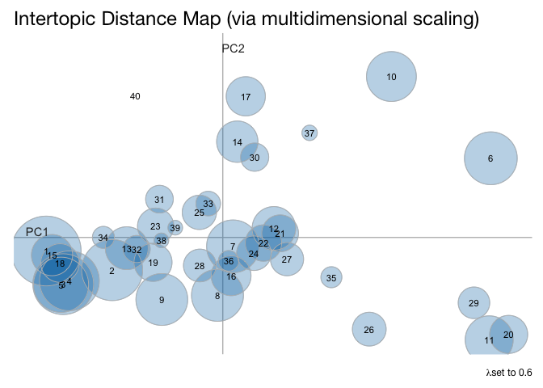

<!-- README.md is generated from README.Rmd. Please edit that file -->

# twAccount

This package includes a series of functions that allow the user to
extract a brand’s Twitter timeline, visualize the brand identity through
the imagery posted and estimate topic models for both the timeline as
well as the mentions of that brand.

Twitter extraction capabilities are courtesy of `rtweet`. Image
processing and conversion into collages is thanks to the `magick`
package. The topic modeling process relies on the `BTM` package, which
is
<a href="https://github.com/xiaohuiyan/xiaohuiyan.github.io/blob/master/paper/BTM-WWW13.pdf" target="_blank">designed for short texts</a>
as opposed to standard LDA, which relies on a larger corpus. The `BTM`
output is then processed using several functions borrowed from the
`LDAvis` package.

## Installation

You can install the development version of twAccount from
[GitHub](https://github.com/) with:

``` r
# install.packages("devtools")
devtools::install_github("taylorgrant/twAccount")
remotes::install_github("taylorgrant/twAccount")
```

## Usage

``` r
# Full Usage 
twitter_tm("BMWUSA", search_query = "bmw", topic_ct = 40, term_ct = 30)

# If you have a timeline from `rtweet` with/without mentions, and just want topic models 
run_btm("BMWUSA", data_source = 'timeline', n_topics = 40, n_terms = 30)

# If you have a timeline and want images 
get_pics(dir_location, timeline)
# If you want to make final collages
unique(lubridate::year(timeline$created_at)) %>% 
  purrr::walk(make_collage)
```

The package provides an overall wrapper function `twitter_tm()` that
will extract (1) a brand’s Twitter timeline, (2) recent, public tweets
matching a boolean search, and (3) all images that a brand has included
in its publicly available tweets.

Once the data is extracted, a model is run to estimate topic models
based upon the Biterm Topic Models algorithm in the `BTM` package.
Currently, the model is specified to run based on the number of topics
selected by the user, rather than running through a series of topic
sizes and maximizing the log-likelihood (maybe later). The topic
modeling process yields estimates of where the topics lie in 2d space,
as well as the top N most salient terms for each topic (N terms
specified by the user).

Estimation of the 2d space relies upon the
<a href="https://en.wikipedia.org/wiki/Jensen%E2%80%93Shannon_divergence" target="_blank">Jensen-Shannon Divergence</a>,
the estimates of which are then scaled via PCA. This allows for easy
visualization of the topics on an X,Y axis. For example, if we took the
last 3,200 tweets from the
<a href="https://twitter.com/BMWUSA?ref_src=twsrc%5Egoogle%7Ctwcamp%5Eserp%7Ctwgr%5Eauthor" target="_blank">BMWUSA</a>
account, a version of the 2d topic model representation would look like
the below. This can be presented in a static graph, or in an html
rmarkdown file using the `crosstalk` package, or you can simply use the
d3 visualization from `LDAvis`.



## Using the package

Ideally, the user would create a new project within RStudio, but this
package will build out a new directory in the current working directory
of the user.

After running the `twitter_tm()` function, the new directory will follow
this structure:

    ├── [HANDLE]
    │   └── [RUN DATE]
    │       ├── [FIRST YEAR OF TWEETS]
    │       ├── [NEXT YEAR OF TWEETS]
    │       ├── [ANOTHER YEAR OF TWEETS]
    │       ├── {handle}_tm_timeline.rds
    │       ├── {handle}_tm_mentions.rds
    │       ├── {handle}_twitter_info.rds
    │       └── local_cols
    └── [udpipe MODEL]
